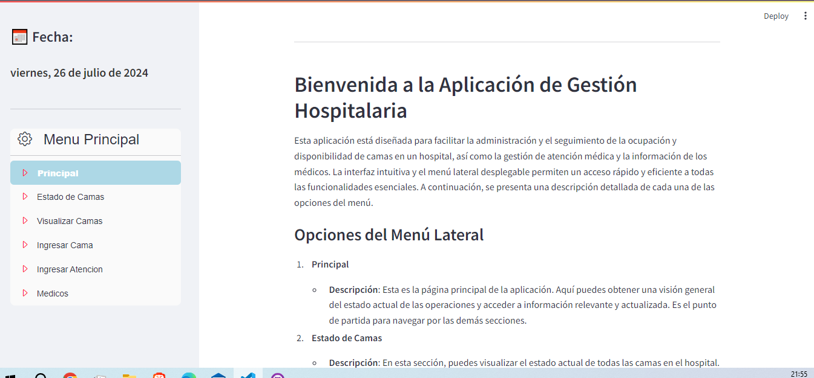

# Sanatorio:
 ### Gestión de Camas y Atencion a Pacientes


# Índice

1. [Funcionalidades Principales](#funcionalidades-principales)
2. [Requisitos](#requisitos)
3. [Modo de uso](#modo-de-uso)
4. [Estructura del Proyecto](#estructura-del-proyecto)
5. [Imagenes](#images)
6. [Archivos Principales](#archivos-principales)
7. [Notas](#notas)
8. [Contacto](#contacto)
9. [Tecnologías utilizadas](#tecnolog%C3%ADas-utilizadas)

La aplicación de gestión de atención médica, desarrollada con Streamlit, permite registrar y gestionar atenciones de pacientes hospitalizados. Los usuarios pueden seleccionar camas, visualizar información detallada de los pacientes, ingresar datos de atención médica, y actualizar registros. Además, facilita la descarga de informes personalizados con la información completa del paciente, ayudando a mantener un seguimiento eficiente y preciso de los tratamientos y procedimientos médicos.

## Funcionalidades Principales

1. **Gestión de Camas:**
   - **Alta de Cama Vacía:** Permite registrar una cama vacía y asignar datos del paciente cuando la cama es ocupada.
   - **Visualización y Gestión de Datos del Paciente:** Permite visualizar y actualizar los datos de los pacientes asociados a cada cama.

2. **Registro de Procesos Médicos:**
   - **Diagnóstico:** Registro y actualización de diagnósticos médicos realizados a los pacientes.
   - **Laboratorios:** Gestión de datos de laboratorios y resultados asociados a los pacientes.
   - **Exámenes Complementarios:** Registro y gestión de exámenes complementarios realizados.
   - **Tratamientos y Procedimientos:** Registro y seguimiento de tratamientos y procedimientos médicos, incluyendo fechas.

3. **Antibióticos (ATB):**
   - **Registro de Tratamientos con Antibióticos:** Permite registrar y llevar un seguimiento de las fechas de tratamiento con antibióticos.
   - **Finalización de Tratamientos:** Permite registrar la finalización de los tratamientos con antibióticos.

4. **Historial Clínico de Cama:**
   - **Registro de Actividades Médicas:** Permite llevar un registro completo de todas las actividades médicas realizadas a los pacientes en una cama específica.
   - **Visualización para Revisión Médica:** Facilita la revisión del historial clínico por otros médicos para verificar el tratamiento previo del paciente.

5. **Descarga de Datos:**
   - **Exportación de Informes:** Los datos filtrados pueden ser descargados en formato Excel para un análisis adicional.
   - **Informe Personalizado:** Genera informes personalizados con la información completa del paciente para su descarga.


## Requisitos

Asegúrate de tener Python 3.x instalado y las siguientes bibliotecas requeridas:

- Pandas
- Streamlit


Puedes instalar las dependencias con el siguiente comando:

```
pip install pandas streamlit
```

## Modo de uso

### Cómo Inicializar en tu PC.

Para ejecutar esta aplicación en tu máquina local, sigue estos pasos:

1. Clona este repositorio en tu sistema local.
```
    git clone <URL-del-repositorio>
    cd nombre-del-repositorio
```

2. **Instalar Dependencias:**

    Asegúrate de tener Python y pip instalados. Luego, instala las dependencias necesarias ejecutando:
```
    pip install -r requirements.txt
```
3. **Ejecutar la Aplicación:**

    Una vez que todas las dependencias estén instaladas, puedes ejecutar la aplicación usando Streamlit:

```
    streamlit run main.py
```

4. **Interactuar con la Aplicación:**

    Abre tu navegador y visita http://localhost:8501 para ver y utilizar la aplicación.

    


## Estructura del Proyecto

La aplicación se organiza a través de un menú principal con las siguientes opciones:

**1. Principal:**

- Indicaciones de uso.

**2. Estados de Camas:**

Muestra el estado actual de las camas y los pacientes, incluyendo las camas vacías y ocupadas.

**3. Visualizar Camas:**

- Permite agregar, observar y gestionar camas. Los usuarios pueden ver detalles de los pacientes asignados a cada cama y actualizar información médica.

**4. Ingresar Camas:**

- Permite registrar una nueva cama vacía.

**5. Ingresar Atencion:**

- Permite ingresar datos de un nuevo paciente a una cama existente.

**6. Médicos:**

- Permite ingresar datos de un nuevo medico a una cama existente.


## Imagenes




## Archivos Principales

**- main.py:** 
  Archivo principal que contiene el código de la aplicación.

**Archivos Excel (.xlsx):**
**- data:** 
   - ATB.xlsx
   - Cama.xlsx
   - Cultivo.xlsx
   - Examen Complementario.xlsx
   - Funciones Fisiologicas.xlsx
   - Laboratorio.xlsx
   - Medico.xlsx
   - Paciente.xlsx
   - Procedimiento.xlsx

**- imagen:**
   - Banner.jpg : Utilizadas en la interfaz de usuario.


## Notas

Asegúrate de mantener actualizados los archivos Excel en el directorio raíz del proyecto para que la aplicación funcione correctamente.

## Contacto

### Blas Fernando Pacios

[   
](https://www.linkedin.com/in/blas-fernando-pacios) 
[
](https://wa.me/5493815467488)

## Tecnologías utilizadas


